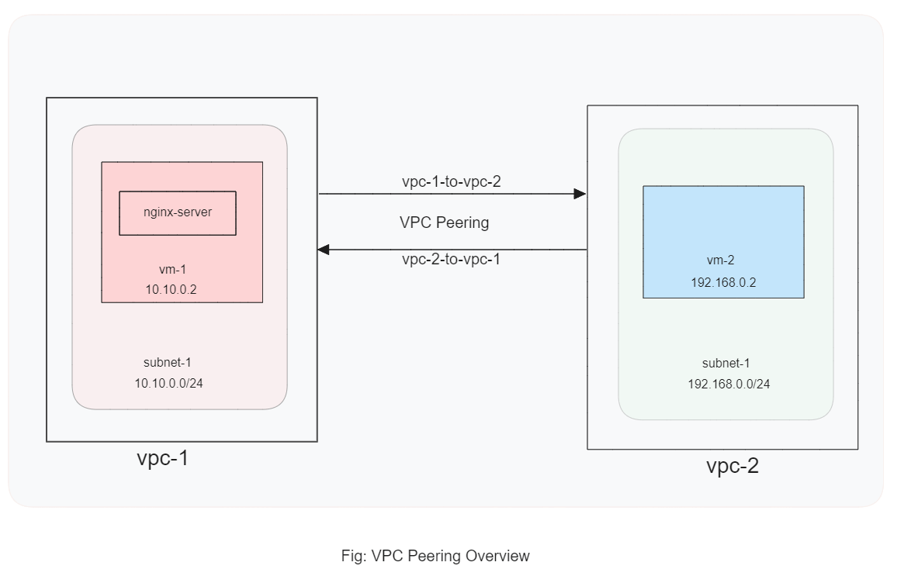
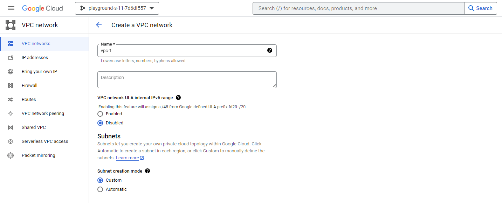
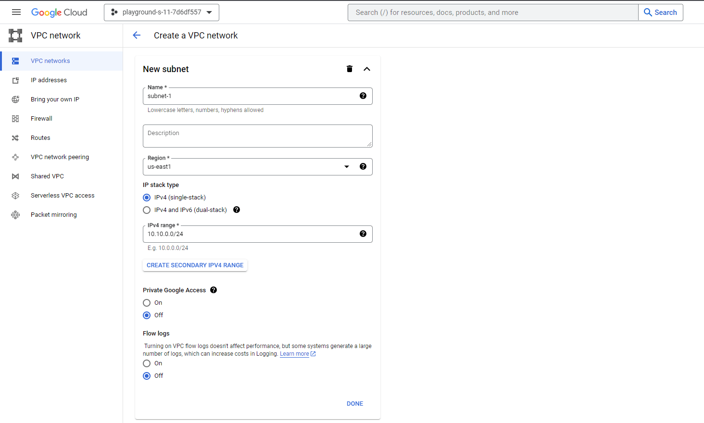
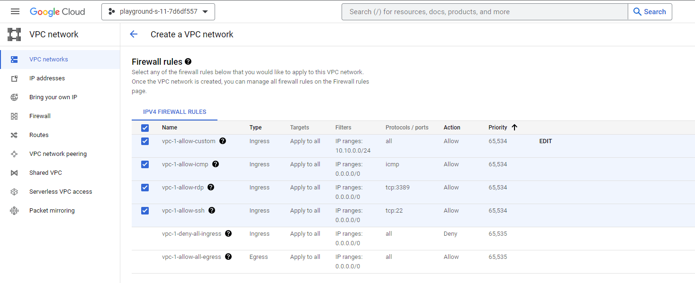
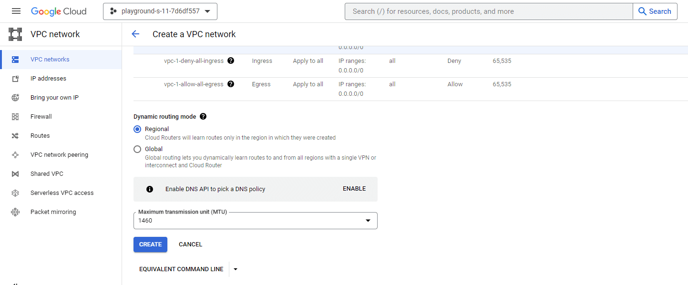
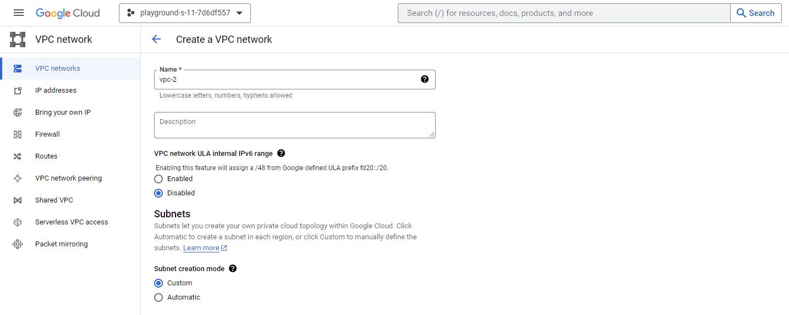
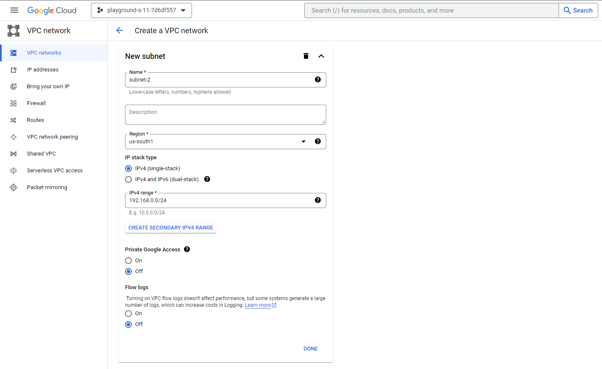
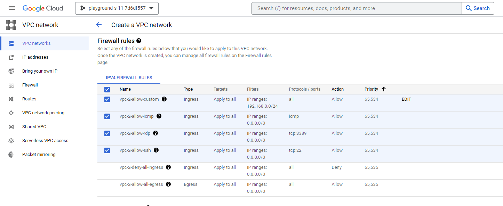
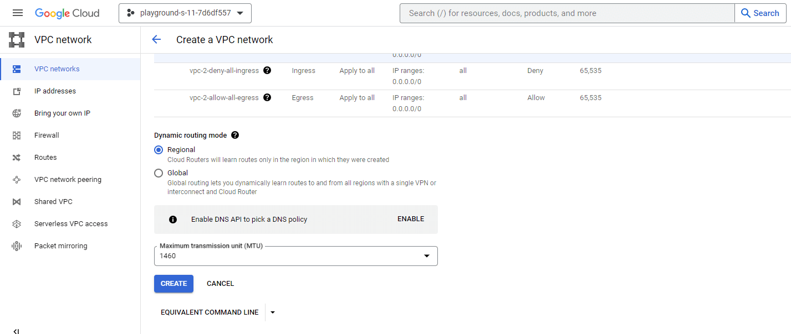

## Google Cloud VPC Network Peering to Connect Two VMs and Check Nginx Server Access.

### Description

Explore hands-on VPC network peering within Google Cloud Platform (GCP). We'll create separate VPCs in different regions, set up VMs in each VPC, and deploy an Nginx server. Witness the practical dynamics of VPC network peering as these elements interact, gaining real-world insights into this powerful GCP feature.

### Overview Diagram

<figure > 

  

</figure>

### Prerequisites

- Google Cloud Platform(GCP) account or playground.
- Knowledge about VPC, VM instance, Subnet, Network interface.

### Step-1: Create Two VPCs:

Creating <code>vpc-1</code>
 

Creating <code>vpc-2</code>
 

