# Google Cloud VPC Network Peering to Connect Two VMs and Check Nginx Server Access.

## Description

Explore hands-on VPC network peering within Google Cloud Platform (GCP). We'll create separate VPCs in different regions, set up VMs in each VPC, and deploy an Nginx server. Witness the practical dynamics of VPC network peering as these elements interact, gaining real-world insights into this powerful GCP feature.

## Overview Diagram

<figure > 
<p align="center">
  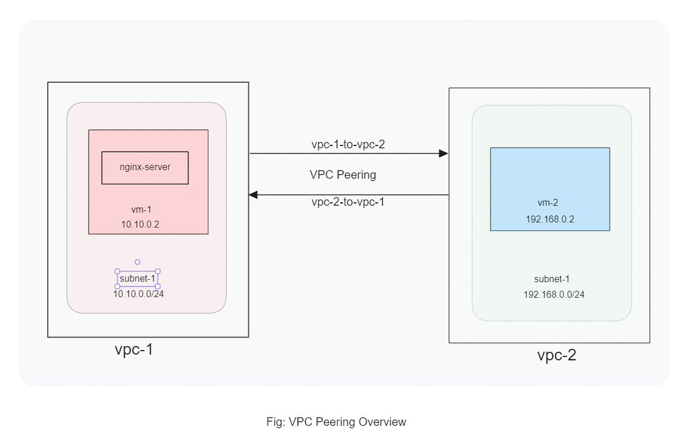
</p>
</figure>

## Prerequisites

- Google Cloud Platform(GCP) account or playground.
- Knowledge about VPC, VM instance, Subnet, Network interface.

## Hands On:

### _Create Two VPCs_:

<details>
<summary>Creating <code>vpc-1</code></summary><br/>


</details>

<details>
<summary>Creating <code>vpc-2</code></summary><br/>


</details>

Now we can see the `vpc-1` and `vpc-2` are in the list.

<figure > 
<p align="center">
  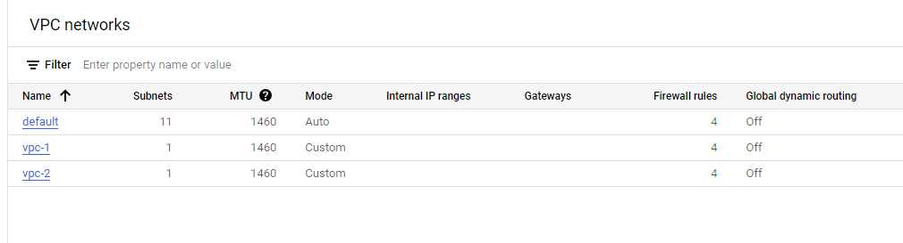
</p>
</figure>

### _Create Two VMs_:

<details>
<summary>Creating <code>vm-1</code></summary><br/>
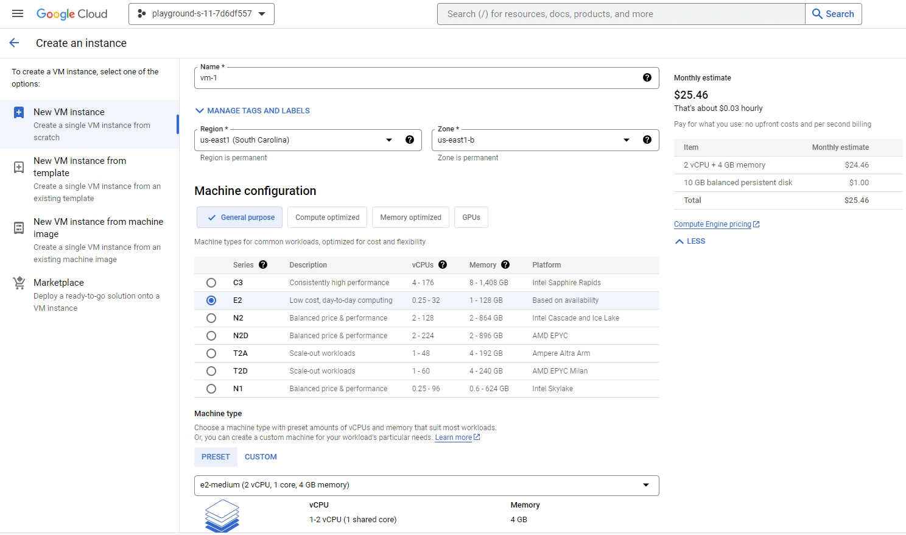
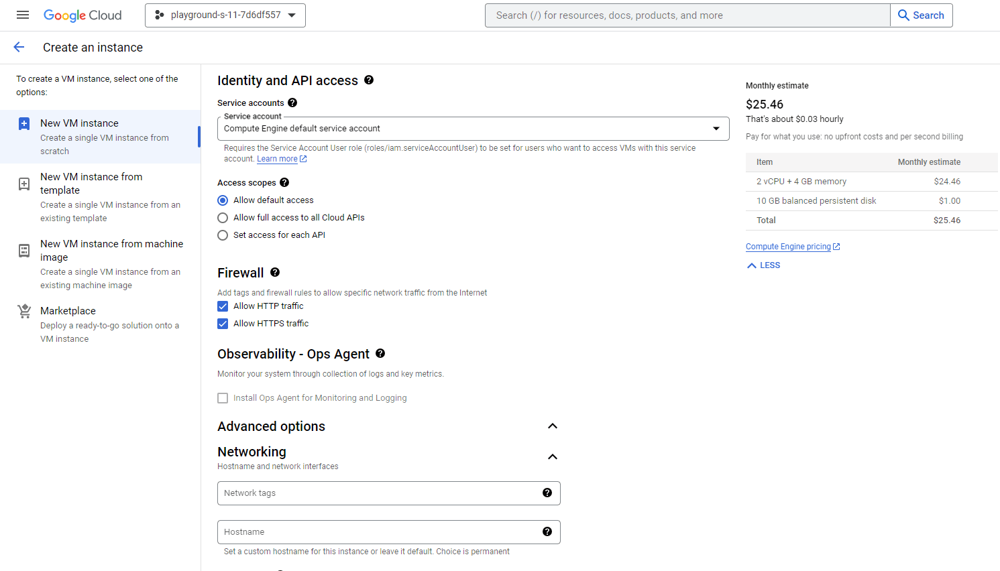
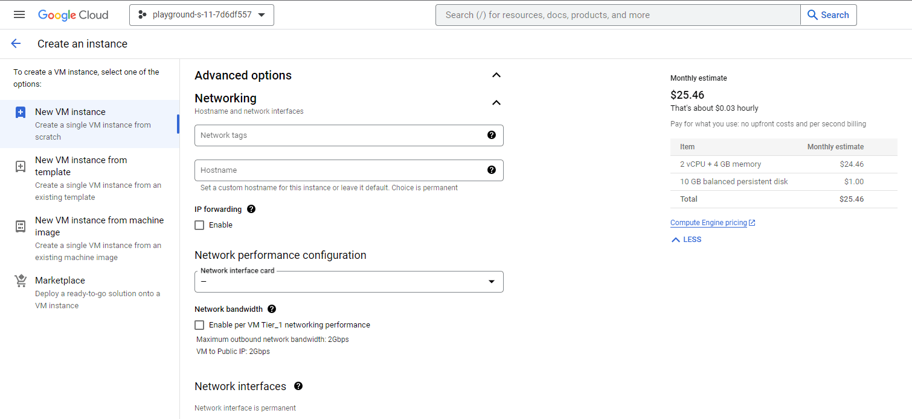
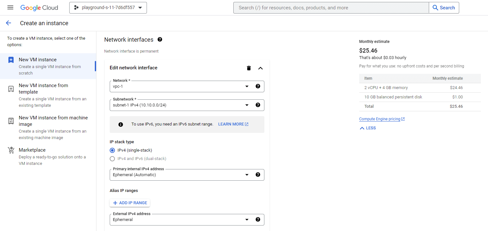
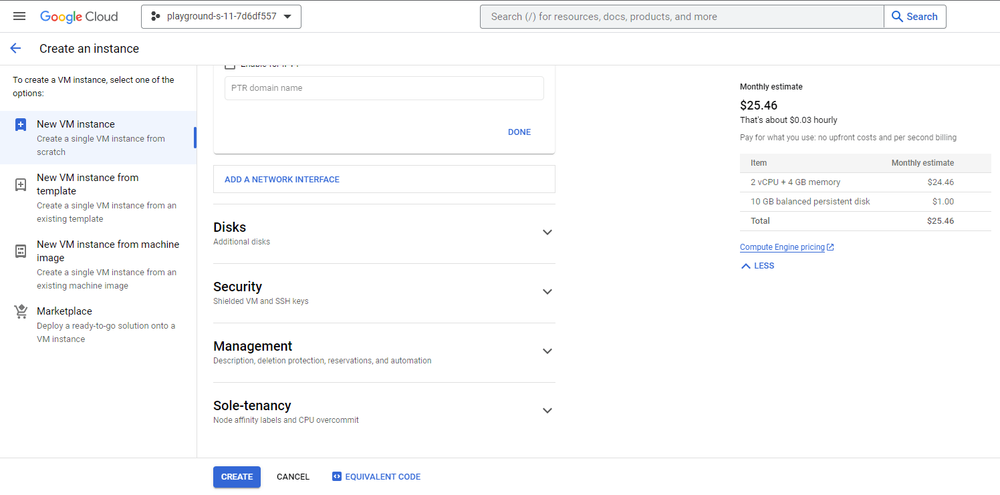
</details>

<details>
<summary>Creating <code>vm-2</code></summary><br/>
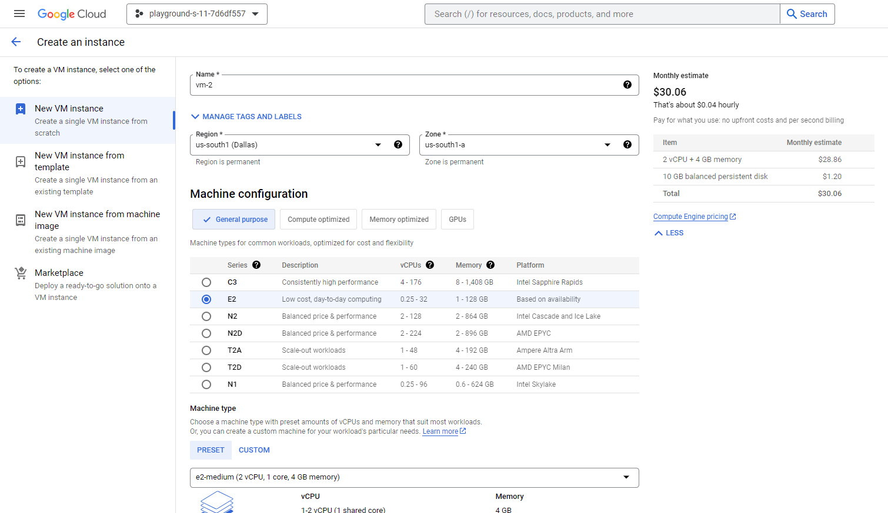


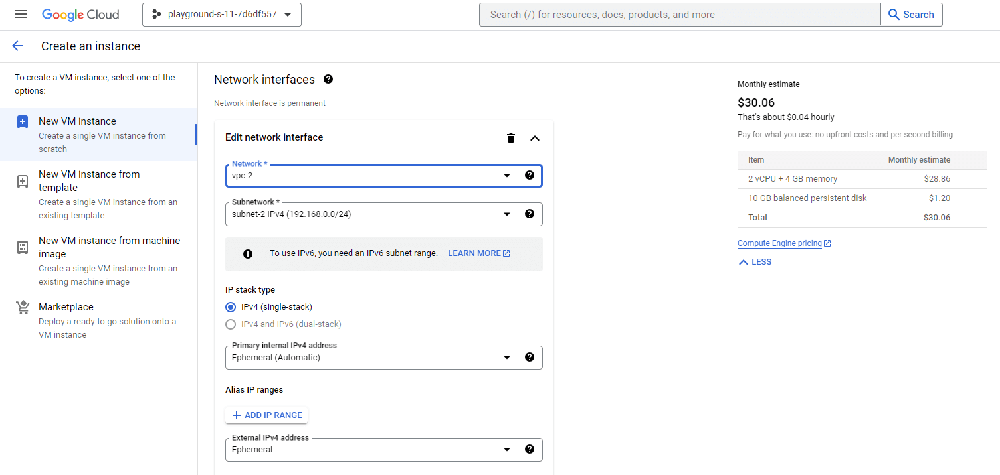

</details>

Now we can see the `vm-1` and `vm-2` list.

<figure > 
<p align="center">
  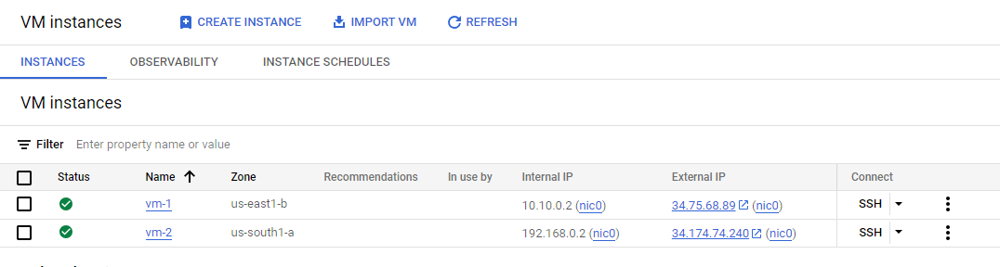
</p>

### _Peering Two VPC_:

<details>
<summary>Peering <code>vpc-1</code> to <code>vpc-2</code></summary><br/>
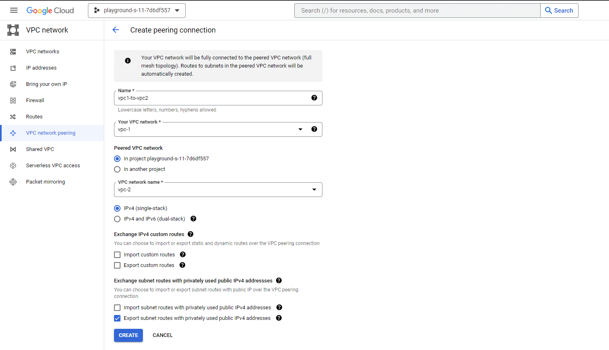
</details>

<details>
<summary>Peering <code>vpc-2</code> to <code>vpc-1</code></summary><br/>
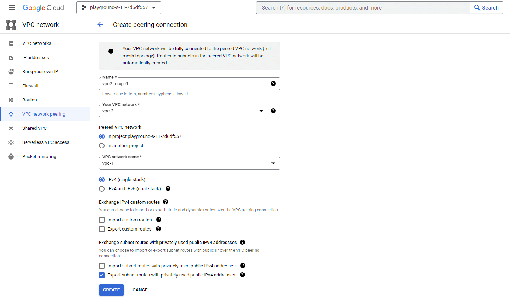
</details>

Now we can see the two active network peering.

<figure > 
<p align="center">
  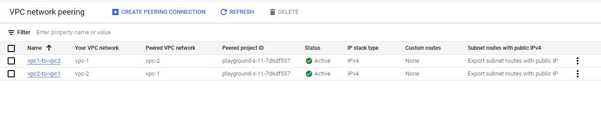
</p>

### _Check Connection_:

Now if we try to connect from `vm-1` to the `vm-2`, it will be connected now.

<details>
<summary>Ping from <code>vpc-1</code> to <code>vpc-2</code></summary><br/>
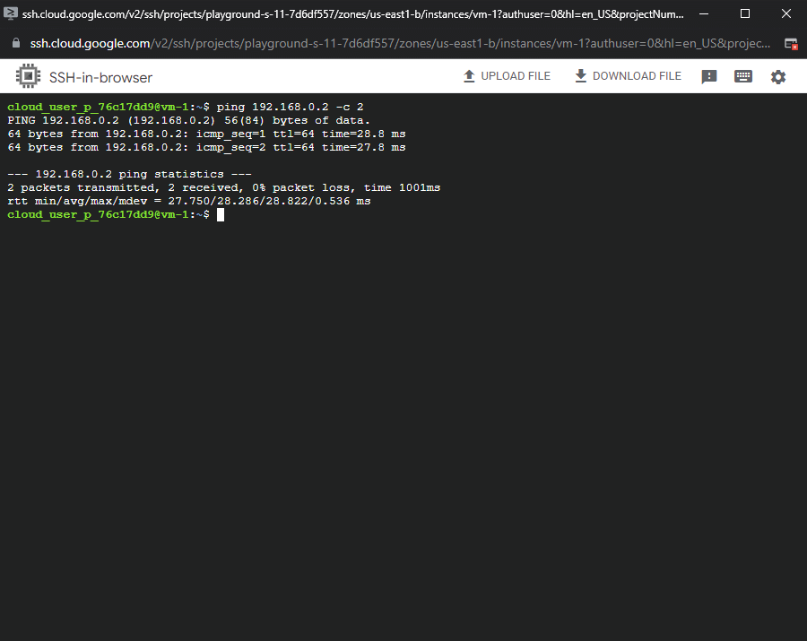
</details>

### _Create Nginx at One VM And Access From Others_:

Here we will install nginx at `vm-1` and will try to access from `vm-2`.

- At vm-1 terminal, use the following command.

  To update app:

  ```bash
  sudo apt update -y
  ```

  To install nginx:

  ```bash
  sudo apt install nginx
  ```

  To check nginx service status::

  ```bash
  systemctl status nginx
  ```

  We will get the output like:

<figure > 
<p align="center">
  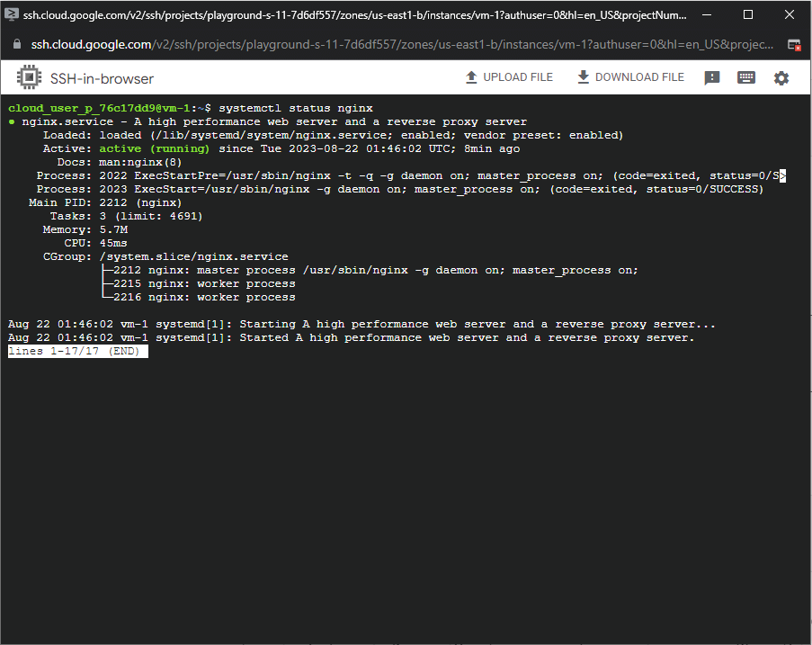
</p>
</figure>

- Now we will try to access from `vm-2` terminal:

  ```bash
  curl http://34.75.68.89
  ```

  We will get the output like:

<figure > 
<p align="center">
  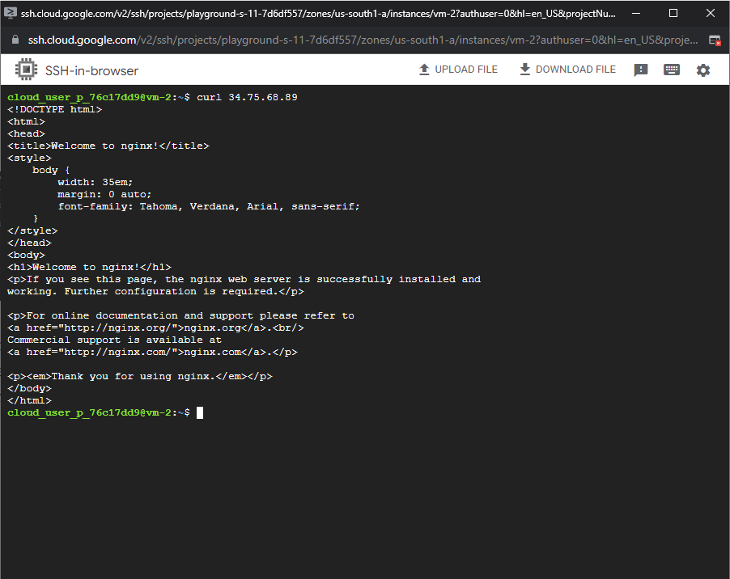
</p>
</figure>
